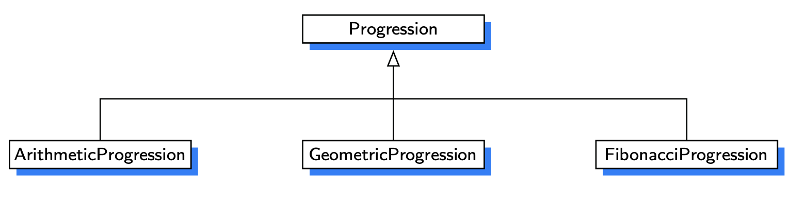

# Numeric Progression

# Definitions
## nextValue()
> A public method that returns the next value of the progression, implicitly advancing the value each time

## advance()
> A protected method that is responsible for advancing the value of currnt in the progression.
